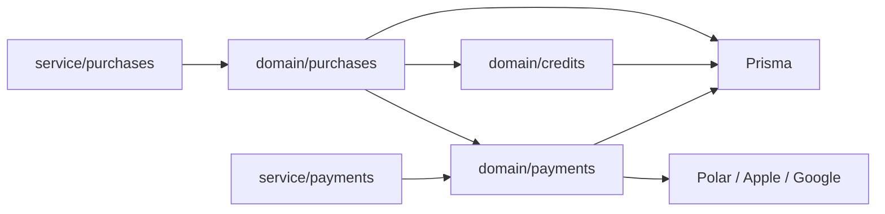
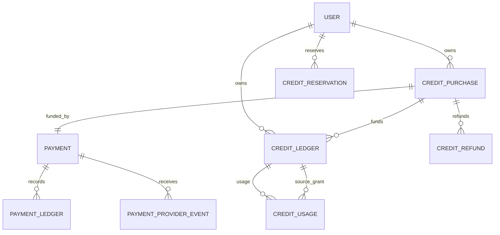
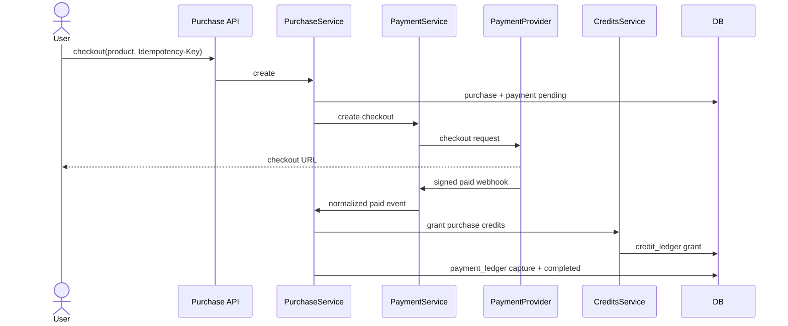
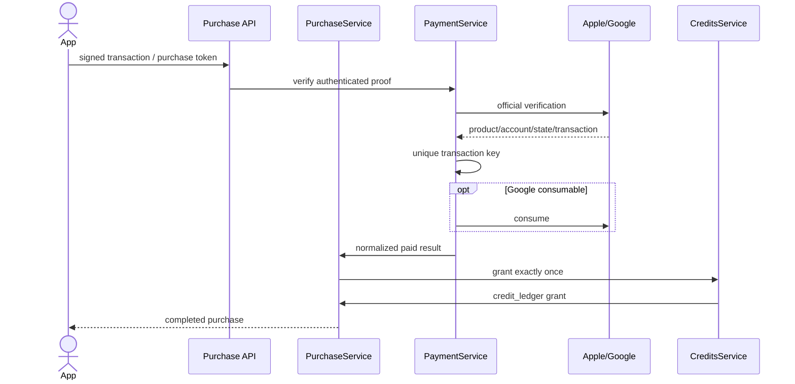
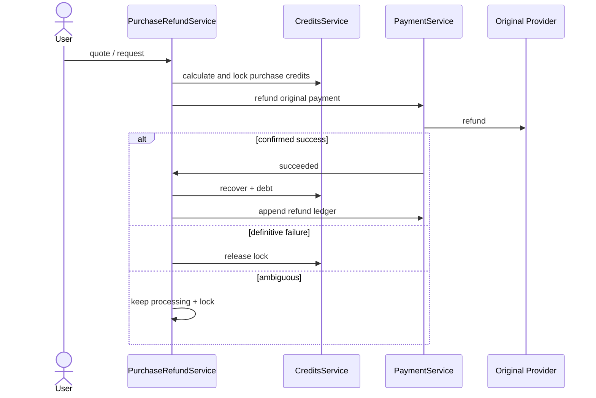

# 크레딧 구매·결제·환불 백엔드 구현 계획

## 0. 상태

- 설계 승인 및 구현 지시: 2026-08-04
- 소스 구현: 완료
- 배포 마이그레이션: 완료 — 신규개발·기존 데이터 0건 전제
- 대상: `opod-service-backend`의 사용자용 API, 도메인 로직, canonical Prisma schema
- 제외: iOS/Android 클라이언트, 웹 프론트엔드, 관리자 API/UI, 실제 PG 정산 입금 대사
- blocking decision: 0개

## 1. 목표

사용자가 Web, Apple App Store, Google Play에서 크레딧을 구매하고, 검증된 결제에만
정확히 한 번 크레딧을 지급받으며, 환불·취소·차지백 시 정책대로 크레딧을 잠그고
회수한다.

도메인은 다음처럼 분리한다.

- `purchases`: 사용자의 크레딧 구매 계약과 구매/환불 유스케이스 조정
- `payments`: 금전 상태, 불변 금전 원장, provider 연동과 webhook 검증
- `credits`: 크레딧 지급·사용·예약·회수와 불변 크레딧 원장

## 2. 현재 상태와 목표 상태

### 현재 (`repo-evidenced`)

- `CreditsService`가 checkout, 결제 webhook, 구매 목록, 환불, 크레딧 회계를 모두 소유한다.
- 결제 provider는 development 전용 `local` stub이며 production에서는 거절된다.
- `CreditLedgerEntry.remainingAmount`를 차감하므로 원장 불변 정책과 충돌한다.
- `CreditAccount.paidDebt`는 mutable 집계이며 크레딧 원장과 중복된다.
- `CreditRefundAllocation`이 환불 워크플로와 크레딧 회수 명세를 별도로 보유한다.

### 목표 (`user-confirmed`)

- Polar는 최초 Web provider일 뿐이며 구매/결제 코드는 특정 PG에 의존하지 않는다.
- Apple/Google consumable IAP를 공식 서버 검증 방식으로 지원한다.
- 관계·원장은 중복 없이 8개 핵심 테이블로 정리한다.
- 운영자 조회는 테이블을 합치지 않고 query projection으로 구매·결제·크레딧을 연결한다.
- 실제 PG 정산은 이후 확장하되 현재 거래 식별자와 금전 사실을 보존한다.

## 3. 범위 지도

| 분류                      | 내용                                                                                                                                            |
| ------------------------- | ----------------------------------------------------------------------------------------------------------------------------------------------- |
| in-scope                  | 상품 조회, Web checkout, Polar webhook/환불, Apple/Google 검증, provider webhook, 구매 목록, Web 환불 견적/신청, Store reversal, 불변 원장 전환 |
| preserve-current-behavior | 가격표, 무료 지급, FIFO 사용, 예약/capture/release, Web 50%/5% 환불, 구매 연계 프로모션 회수, 유상 부채                                         |
| extension-boundary        | provider-neutral adapter, 불변 provider transaction key, `payment_ledger`의 외부 거래 reference                                                 |
| deferred                  | 실제 PG 정산 입금/수수료/세금 대사, 정기 reconciliation worker, 운영 credential 등록, 앱 클라이언트 구현                                        |
| out-of-scope              | 일반 주문/장바구니/배송, 구독, 관리자 화면/API                                                                                                  |

## 4. 결정 원장

| ID   | 결정                                                                         | 출처                 | 상태   |
| ---- | ---------------------------------------------------------------------------- | -------------------- | ------ |
| D-01 | `purchases`, `payments`, `credits`를 별도 도메인으로 둔다.                   | user-confirmed       | active |
| D-02 | 현재 상품은 `CreditPurchase`; 일반 `Order`로 추상화하지 않는다.              | user-confirmed       | active |
| D-03 | `payments`는 provider-neutral이며 Polar는 adapter이다.                       | user-confirmed       | active |
| D-04 | 백엔드만 구현하고 Apple/Google 클라이언트 코드는 제외한다.                   | user-confirmed       | active |
| D-05 | 핵심 테이블은 아래 8개이며 `Entry`, allocation 이름을 사용하지 않는다.       | user-confirmed       | active |
| D-06 | 확정 사용 출처 테이블명은 `credit_usage`다.                                  | user-confirmed       | active |
| D-07 | 환불 workflow와 회수 명세는 `credit_refund` 하나로 합친다.                   | user-confirmed       | active |
| D-08 | 운영자 통합 조회용 중복 관계 테이블은 만들지 않는다.                         | user-confirmed       | active |
| D-09 | 실제 PG 정산은 이후 추가하며 현재는 대사 가능한 식별자/금전 원장을 보존한다. | user-confirmed       | active |
| D-10 | success redirect가 아니라 검증된 provider 결과만 지급 근거다.                | externally-evidenced | active |
| D-11 | Store 환불/취소/차지백은 Web 50%/5% 정책을 적용하지 않는다.                  | user-confirmed       | active |

## 5. 도메인과 의존 방향

금지 방향:

- `credits → purchases/payments`
- provider adapter가 구매나 크레딧 원장을 직접 수정
- controller가 provider 성공 payload를 보고 직접 크레딧 지급
- `purchases`가 Polar/Apple/Google 전용 payload 타입을 import

## 6. DB Schema — 8개 핵심 테이블

`credit_check_ins`는 무료 지급을 발생시키는 별도 기능 테이블이므로 핵심 결제/크레딧
회계 테이블 수에 포함하지 않고 유지한다.

### 6.1 관계

### 6.2 테이블 책임

| Table                     | 책임                                                                |
| ------------------------- | ------------------------------------------------------------------- |
| `credit_purchases`        | 사용자, 상품/지급량 snapshot, 구매 상태, 멱등 키                    |
| `payments`                | 구매별 현재 금전 상태, channel/provider, 외부 checkout/transaction  |
| `payment_ledger`          | capture/refund/chargeback/adjustment 금전 사실 append-only 기록     |
| `payment_provider_events` | webhook/notification 멱등 inbox와 처리 상태                         |
| `credit_ledger`           | grant/usage/refund_recovery/adjustment 크레딧 사실 append-only 기록 |
| `credit_usage`            | 확정 사용이 어느 grant에서 차감됐는지 기록                          |
| `credit_refund`           | 환불 상태, 금액 snapshot, 크레딧 잠금·회수·부채 합계                |
| `credit_reservations`     | 외부 작업 완료 전 임시 사용 예약                                    |

### 6.3 핵심 불변식

1. `payments.purchase_id`는 unique이며 구매 하나에 결제 하나다.
2. `(provider, provider_transaction_key)`는 unique이며 proof replay로 중복 지급할 수 없다.
3. `payment_ledger`와 `credit_ledger`는 update/delete하지 않고 정정 행만 추가한다.
4. 하나의 구매 성공은 정확히 하나의 primary paid grant를 만든다.
5. `credit_usage`는 `usage_ledger_id`, `grant_ledger_id`, `amount`로 사용 출처를 보존한다.
6. `credit_refund`는 구매 단위로 잠금하며 구매와 연결된 grant/promotion을 `purchase_id`로 계산한다.
7. 환불의 실제 금전 성공은 `payment_ledger.refund`, 실제 크레딧 회수는
   `credit_ledger.refund_recovery`가 증명한다.
8. 유상 부채는 mutable account가 아니라 유상 grant - 유상 usage - recovery + adjustment로 계산한다.
9. 가용 잔액은 원장 잔액에서 활성 reservation과 processing refund lock을 뺀 값이다.

### 6.4 정산 확장 경계

현재 `payment_ledger`에는 다음 값을 불변으로 저장한다.

- `payment_id`, `type`, `direction`
- provider가 확정한 minor-unit `amount`, `currency`
- `provider_transaction_id`, `provider_event_id`
- 실제 발생시각 `occurred_at`

Store 구매 proof가 가격을 제공하지 않는 경우 `amount`/`currency`는 nullable로
유지하고 provider transaction ID를 보존한다. 이후 정산 보고서 import가 실제
입금액·수수료·세금을 settlement item에 기록한다.

향후 실제 PG 입금 대사가 필요하면 `payment_settlements`와
`payment_settlement_items(payment_ledger_id, settled_amount, fee, tax)`를 추가할 수 있다.
현재 테이블이나 API의 의미를 변경하지 않고 ledger 외부 거래 ID로 연결할 수 있다.

## 7. 정책

### 상품

| product        | Web 가격 | 지급 credit |
| -------------- | -------: | ----------: |
| `credits_500`  |   ₩4,900 |         500 |
| `credits_1050` |   ₩9,900 |       1,050 |
| `credits_3300` |  ₩29,000 |       3,300 |
| `credits_5750` |  ₩49,000 |       5,750 |

- backend는 client가 보낸 가격/credit 수량을 신뢰하지 않는다.
- IAP localized price는 StoreKit/Play Billing이 표시하고 backend는 product mapping과 지급량을 검증한다.

### 구매

- Web checkout은 `Idempotency-Key`가 필수다.
- redirect는 증명이 아니며 서명·공식 서버 API로 검증한 결과만 `paid` 처리한다.
- 같은 proof의 같은 사용자 replay는 기존 구매를 반환하고 다른 사용자면 conflict다.
- 유상 grant는 만료되지 않으며 기존 paid debt를 먼저 해소한다.

### Web 사용자 환불

- 원래 구매 유상 크레딧의 50% 이상이 환불 가능한 상태로 남아야 한다.
- 남은 환불 가능 paid credit 전체를 환불하고 gross의 5%를 수수료로 공제한다.
- 활성 사용 reservation이 있으면 환불을 시작하지 않는다.
- 환불 생성과 동시에 회수 가능 크레딧을 잠근다.
- provider 성공 시 금전 원장과 회수 원장을 추가하고 완료한다.
- 확정 실패/취소면 lock을 해제한다.
- timeout/5xx는 결과 불명확이므로 processing과 lock을 유지한다.

### Store reversal

- Apple/Google 환불은 Store에서 수행한다.
- 검증된 refund/revoke/chargeback은 50%/5%를 적용하지 않는다.
- 구매 paid grant와 연결 promotion을 전량 회수하고 부족분은 paid debt로 남긴다.
- notification replay는 추가 회수하지 않는다.

### 보안

- raw receipt, signed transaction, purchase token, webhook raw payload를 영구 평문 저장하지 않는다.
- transaction/token SHA-256 key, 공개 가능한 external reference, product/environment/status만 보존한다.
- proof 원문은 일절 저장하지 않는다. Google consume 이후 DB 실패는 같은 사용자의 client
  retry에서 소비 완료 token을 다시 검증하거나 RTDN 재수신으로 복구한다.
- Polar webhook signature, Apple JWS chain, Google Pub/Sub OIDC와 Publisher API 결과를 검증한다.

## 8. API

### 사용자 구매 API

| Method | Path                                             | 결과                        |
| ------ | ------------------------------------------------ | --------------------------- |
| GET    | `/purchases/products?channel=web\|apple\|google` | channel별 상품              |
| GET    | `/purchases/account-token`                       | Store account binding token |
| POST   | `/purchases/checkouts`                           | Web purchase + checkout     |
| POST   | `/purchases/in-app/apple/verify`                 | Apple 검증·지급             |
| POST   | `/purchases/in-app/google/verify`                | Google 검증·consume·지급    |
| GET    | `/purchases`                                     | 본인 구매 목록              |
| GET    | `/purchases/:id/refund-quote`                    | Web 환불 견적               |
| POST   | `/purchases/:id/refunds`                         | Web 환불 신청               |

### provider API

| Method | Path                        | 신뢰 경계                      |
| ------ | --------------------------- | ------------------------------ |
| POST   | `/payments/webhooks/polar`  | raw-body signature             |
| POST   | `/payments/webhooks/apple`  | signedPayload JWS              |
| POST   | `/payments/webhooks/google` | Pub/Sub OIDC + RTDN/API 재검증 |
| POST   | `/payments/webhooks/local`  | non-production 테스트 전용     |

기존 결제용 `/credits/checkout`, `/credits/purchases`, `/credits/payment-webhooks/*`,
`/credits/refunds*`는 repo 내부 소비자가 없어 제거한다. 잔액/원장/출석/사용 API는 유지한다.

## 9. 주요 UML

### Web 구매

### IAP 구매

### Web 환불

## 10. Use Case 재점검

| ID    | Actor / Trigger           | Happy path                                         | 주요 edge / 검증                     |
| ----- | ------------------------- | -------------------------------------------------- | ------------------------------------ |
| UC-01 | 사용자 / 상품 조회        | channel mapping과 지급량 반환                      | 비활성/미설정 상품 제외              |
| UC-02 | 사용자 / Web checkout     | purchase/payment 멱등 생성, provider URL 반환      | key 재사용 input conflict            |
| UC-03 | Polar / paid webhook      | 서명·금액·상품·사용자 검증 후 1회 지급             | replay 2xx, 변조 403                 |
| UC-04 | 앱 사용자 / Apple verify  | JWS·bundle·environment·account token 검증 후 지급  | 타 사용자 transaction conflict       |
| UC-05 | 앱 사용자 / Google verify | token/account/product/state 검증, consume 후 지급  | 소비 완료 token의 동일 사용자 재시도 |
| UC-06 | 사용자 / 구매 목록        | 본인 구매만 cursor pagination                      | 타 사용자 데이터 비노출              |
| UC-07 | 사용자 / 환불 견적        | 50%, 5%, lock, promotion, 예상 debt 계산           | active usage reservation 거절        |
| UC-08 | 사용자 / Web 환불         | original provider로 요청, 성공 시 금전/credit 원장 | timeout lock 유지, 확정 실패 해제    |
| UC-09 | Store / reversal          | 강제 회수, 부족분 debt                             | notification replay 멱등             |
| UC-10 | 서비스 / reserve-capture  | 성공 시 usage 원장과 사용 출처 생성                | 만료/release면 원장 없음             |
| UC-11 | 운영 조회 / 추후 admin    | purchase→payment→money/credit timeline 연결 가능   | 중복 관계 테이블 없음                |
| UC-12 | 정산 / 추후 확장          | provider transaction을 settlement item에 연결      | 이번 구현에서는 API/테이블 미제공    |

## 11. 구현 체크리스트

### Slice 1 — 스키마와 불변 크레딧 원장 (완료)

- 파일: `prisma/schema.prisma`, generated Prisma client, `src/domain/credits/**`
- 결과: `credit_ledger`, `credit_usage`, `credit_refund`, `credit_reservations`로 지급·사용·잠금·회수 계산
- 테스트 가치: FIFO 출처, replay, refund lock/debt, mutable remaining 제거의 데이터 무결성 보호
- 좁은 검증: `npm run db:generate`, `npm run test -- credits.service.spec`

### Slice 2 — provider-neutral payments (완료)

- 파일: `src/domain/payments/**`, provider adapter와 unit specs
- 결과: provider registry, checkout/IAP/refund/event 정규화, payment state/ledger/event inbox
- 테스트 가치: provider 교체, 외부 transaction replay, 잘못된 상태/서명 경계 보호
- 좁은 검증: `npm run test -- payments`

### Slice 3 — 구매 orchestration과 API (완료)

- 파일: `src/domain/purchases/**`, `src/service/purchases/**`, `src/service/payments/**`, module/swagger/architecture
- 결과: 새 `/purchases`와 `/payments/webhooks` 계약, 정확히 한 번 지급/회수
- 테스트 가치: 인증 사용자 소유권, idempotency, 결제-지급 원자성, 공개 오류 보호
- 좁은 검증: 관련 unit + architecture + credits e2e

### Slice 4 — 마이그레이션·호환·문서 (완료)

- 파일: Prisma generated migration, 관련 정책/API/코드베이스 가이드
- 결과: 기존 구매/환불/원장 데이터를 보존하는 expand/backfill/contract 절차와 최신 소유권 문서
- 검증: 빈 DB/fixture DB migration, schema validation, admin mirror drift 확인

사용자가 기존 데이터가 한 건도 없는 신규개발이라고 확인했다. 따라서 기존 credit
테이블을 새 구조로 교체하는 generated migration을 채택했고, migration history만 적용한
완전한 빈 DB에서 `migrate deploy`와 `migrate status`를 검증했다. admin schema mirror
drift 11건은 backend-only 범위 밖이라 수정하지 않았다.

### 전체 검증

- `npm run format`
- `npm run lint`
- `npm run test`
- `npm run test:e2e`
- `npm run build`

실행 결과: lint/build/unit 24 suites 145 tests 통과. 결제·크레딧·Swagger E2E
2 suites 28 tests 통과. 전체 E2E 9 suites 59 tests 통과. 빈 DB에 migration 17개를
순서대로 적용한 뒤 schema가 최신 상태임을 확인했다.

## 12. 승인 기록

사용자는 2026-08-04 정산 기능을 차후 확장할 수 있으면 현재 설계로 진행하라고
명시했다. 실제 정산 기능은 deferred이며, 대사용 `payment_ledger` 식별자를 현재
extension boundary로 유지한다.
