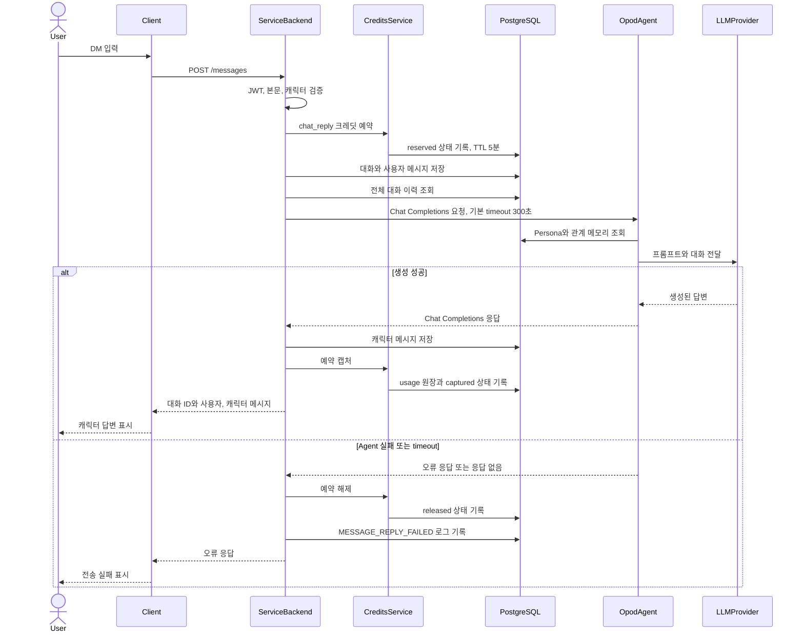
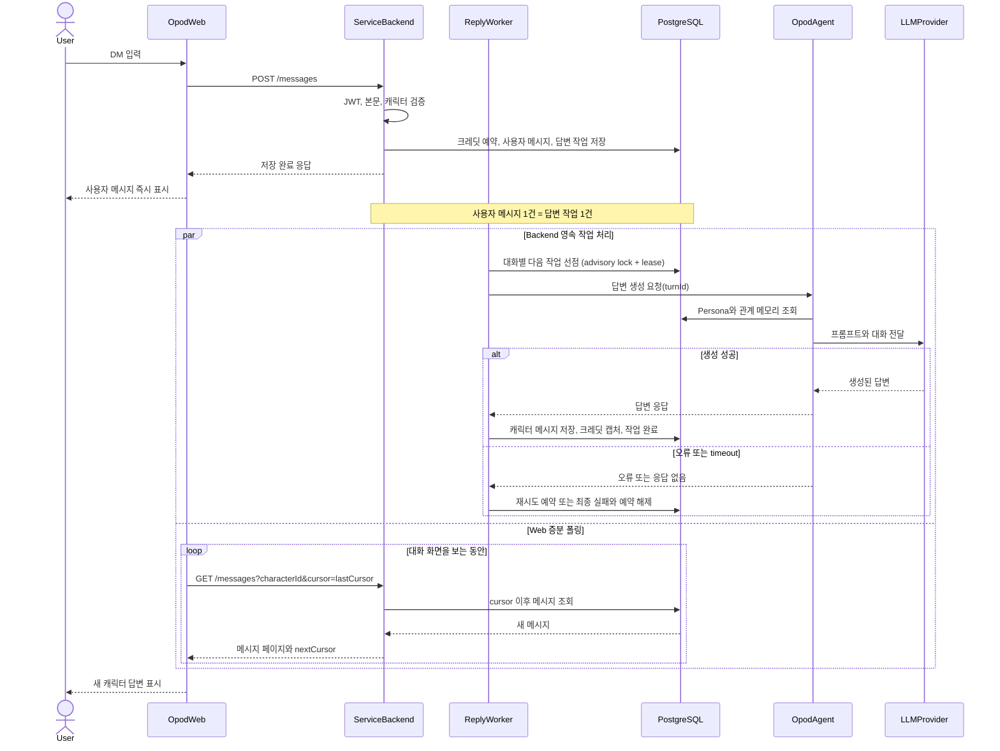

# 06. 아키텍처

> 분류 범례는 [00-overview.md](./00-overview.md) 참조. 모듈별 상세는
> [07-codebase-guide.md](./07-codebase-guide.md).

## System Shape (사실)

- 런타임: NestJS 10 (Node 22, TypeScript strict). 진입점 `src/main.ts` →
  `AppModule` → `ServiceModule`.
- 주요 계층:
  - `src/service/<area>`: HTTP 컨트롤러 + DTO + service 모듈(도메인 wiring).
  - `src/domain/<area>`: DB 접근·비즈니스 로직(`*.service.ts`), 도메인 모듈.
  - `src/domain/database`: 공유 DB 인프라(`PrismaService`, 페이지네이션, uuid).
  - `prisma/schema.prisma`: 정본 데이터 모델.
- 소유권 경계:
  - 이 리포: 유저용 API + 공유 도메인 + **정본 스키마**.
  - opod-admin: 관리자 API·UI, 콘텐츠 작성/발행, 미디어 업로드, 스키마 미러.
  - opod-agent: 대화 생성(OpenAI 호환) + 관계 메모리(observation/reflection).
  - opod-web: 프론트엔드.

## Data Flow (사실)

- Inputs: 유저 HTTP 요청(`Authorization: Bearer` JWT), 결제/환불 webhook,
  클라이언트 이벤트(`POST /events`).
- Processing: 컨트롤러가 인증→도메인 서비스 호출. DM은 크레딧 예약→
  opod-agent 호출→캡처. `purchases`가 구매·환불 유스케이스를 조정하고,
  `payments`가 금전 상태·provider adapter, `credits`가 크레딧 원장을 소유한다.
- Outputs: JSON 응답(커서 페이지네이션), DB 기록, opod-agent로의 아웃바운드
  호출.
- Persistence: PostgreSQL(스키마 `opod`), Prisma. UUIDv7 PK. 미디어는 URL/
  storageKey로 참조하고 공개 URL은 `S3_PUBLIC_BASE_URL`로 조립
  (`src/domain/media/media-url.ts`).

## DM Reply Sequence (현재 구현)

현재 DM 전송은 SSE나 토큰 스트리밍 없이 `POST /messages` 요청 하나가 Agent의
답변 생성 완료까지 기다리는 동기 REST 흐름이다.

- 크레딧 예약이 실패하면 대화와 사용자 메시지를 저장하지 않는다.
- Agent 호출이 실패하면 이미 저장된 사용자 메시지는 유지하고 예약만 해제한다.
- 크레딧 캡처는 캐릭터 메시지 저장 뒤에 실행되므로, 캡처 실패 시 캐릭터 메시지가
  저장된 상태에서 요청이 실패할 수 있다.

## DM Reply Sequence (구현됨)

DM 전송 요청은 **사용자 메시지와 영속 답변 작업 저장까지만 동기 처리**한다.
service-backend의 답변 worker가 저장된 작업을 가져가 기존 opod-agent API를
요청-응답 방식으로 호출하고 완료 결과를 저장한다. opod-web은 기존 메시지 조회
API에 마지막 cursor를 전달해 새 메시지를 주기적으로 조회한다. callback, SSE,
WebSocket은 이 구조의 범위에 포함하지 않는다.

### 확정된 계약

- `POST /messages`의 성공 기준은 사용자 메시지와 영속 답변 작업이 저장된
  시점이다. Agent 답변을 기다리지 않는다.
- service-backend가 답변 작업의 상태, 재시도, Agent 요청, 응답 저장을 소유한다.
  프로세스 내부의 일회성 Promise만으로 작업을 실행하지 않는다.
- 사용자 메시지 1건이 답변 작업 1건이고 답변 1건을 만든다. 연속 발화를 하나로
  묶어 한 번만 답하는 동작은 범위에서 제외했다(2026-08-11). 되살릴 때 스키마는
  바뀌지 않는다 — `messages.reply_job_id`가 이미 N:1이다.
- 같은 대화의 작업은 순서대로 하나씩 처리하고, 서로 다른 대화는 병렬 처리한다.
  Agent 문맥에는 그 작업의 사용자 메시지보다 뒤에 도착한 메시지를 포함하지 않는다.
- 답변이 늦게 도착하므로 대화 전사는 시간순으로 [질문1, 질문2, 답변1, 답변2]처럼
  엇갈릴 수 있다. 어느 답변이 어느 질문의 것인지는 순서가 아니라 `turnId`가
  가리킨다.
- opod-agent는 기존 요청-응답 API로 답변을 반환한다. 비동기 작업이나 callback을
  새로 소유하지 않는다.
- 답변 작업과 Agent 요청은 사용자 메시지 ID인 `turnId`로 연결하며, worker 재시도
  후에도 캐릭터 메시지와 크레딧이 중복 반영되지 않아야 한다.
- opod-web은 새 실시간 전송 채널을 열지 않고 기존 `GET /messages`의 cursor를
  이용해 마지막 조회 이후 메시지만 가져온다.
- worker의 성공 처리에서 캐릭터 메시지 저장, 크레딧 캡처, 작업 완료는 하나의
  완료 단위로 다뤄야 한다.
- Agent 연결 실패, 일시 장애, timeout은 동일한 `turnId`로 최초 요청을 포함해
  최대 3회 시도한다. 영구 실패는 재시도하지 않으며, 성공 결과와 크레딧은 한
  번만 반영한다.
- 크레딧은 작업마다 한 번 예약한다. 이 예약은 `expires_at`이 null이라 시간으로
  만료되지 않고 작업이 직접 capture/release한다 — 독립 TTL을 두면 답변 성공과
  예약 만료가 경합한다. 가용 잔액과 환불 차단 판정에는 활성 예약으로 포함된다.
  실제 처리가 시작된 뒤 15분 안에 성공하면 캡처하고, 최종 실패하거나 15분을
  넘으면 해제한다.
- 최종 실패 시 사용자 메시지는 유지하고 작업을 `failed`로 기록하며, 크레딧
  예약을 해제한 뒤 다음 작업을 계속 처리한다. 사용자에게는 내부 실패 원인을
  노출하지 않는다.
- 실패한 작업은 사용자가 명시적으로 재시도할 수 있다. 재시도는 `readyAt`을 다시
  찍어 현재 대화의 마지막 순서에 배치하고 새 크레딧 예약과 최대 3회·15분 정책을
  적용하며, 동시 재시도는 상태 가드로 하나만 살아남고 진 쪽은 예약을 되돌린다.

### worker 실행

worker는 새 스케줄러 의존성 없이 서비스 프로세스 안에서 재귀 `setTimeout` tick으로
돈다. tick이 필요한 이유는 두 가지다. 재시도는 `ready_at`이 미래인 작업을 만들고,
프로세스가 죽으면 메모리에 있던 신호가 사라져 `queued` 작업과 만료된 lease를
아무도 집지 않는다. 선점은 대화 단위 advisory lock 안에서 하고, 처리 중에는 DB
lease가 소유권을 표시한다. 동작 값은 `MESSAGE_REPLY_*` 환경변수로 조정하며,
`MESSAGE_REPLY_WORKER_ENABLED=false`면 API만 뜨고 worker는 돌지 않는다.

opod-web 코드, 폴링 주기, 화면 이탈 시 중단 조건, pending·failed 표시 방식은
이번 service-backend 구현 범위에서 제외한다.

### 전송 경계 (향후)

현재 worker와 opod-agent 사이에는 기존 HTTP 요청-응답을 사용한다. 차후에는 영속
답변 작업의 의미와 사용자 API를 유지한 채 이 구간을 메시지 브로커(MQ 또는
Kafka) 기반 전달로 교체한다. 이번 구현에서는 브로커 의존성이나 추상화를 미리
추가하지 않는다. (결정/유보)

## Integrations (사실)

- 외부 서비스:
  - opod-agent (`OPOD_AGENT_URL`): DM 답장 생성. OpenAI 호환 chat completion,
    `x-opod-*` 헤더로 관계 식별, `OPOD_AGENT_TIMEOUT_MS`로 설정하는 기본 300초
    타임아웃
    (`src/domain/messages/message-reply.provider.ts`).
  - S3 (`S3_PUBLIC_BASE_URL`): 미디어 공개 URL.
  - 결제 provider: 공통 `PaymentProvider` 경계 뒤에 Web Polar, Apple App Store,
    Google Play adapter가 있으며 local adapter는 개발 환경 전용이다. 운영 전환에는
    credential·상품 ID 등록과 sandbox 검증이 필요하다.
  - 성인인증 provider: **미구성**(production에서 501). 실연동 방향 미정. (미해결)
- 내부 서비스: opod-admin(공유 스키마 미러), opod-agent(공유 스키마의 agent_*
  테이블 read/write).
- 큐/스케줄 잡: 생성·기획·게시(`generation_jobs`, `post_drafts`), consolidation
  (`agent_memory_jobs`)는 **opod-admin/opod-agent가 소유**. 이 리포는 스키마만
  가지며 잡을 실행하지 않는다. (현재 사실 — 스키마 주석) 목표 구조의 DM 답변
  작업은 관리자 생성 잡과 별개이며 service-backend가 소유한다. (결정)

## Operational Constraints

- 성능: 커서 페이지네이션(limit ≤ 50), 인덱스 기반 조회. pgvector는 트리거
  도달 시 도입(db-management.md).
- 보안: JWT(HS256, `AUTH_JWT_SECRET`), scrypt 비번 해시, refresh token은 해시로
  저장·폐기, 세션 advisory lock, 성인인증 식별키는 HMAC 해시로만 보관
  (`ADULT_IDENTITY_HASH_SECRET`). 원문 성인인증 응답·주민번호 미저장.
- 프라이버시: 개인정보 최소수집(IP·UA 미저장). 탈퇴 시 익명화 + 증빙 보존.
  **결정 변경**: 이메일 원문은 법적 보관기간 유지(재가입 차단) — 코드 반영 대기
  (gap, 01-roadmap).
- 신뢰성: 크레딧 예약/캡처/해제 멱등, 사용자 단위 직렬화. DM 답장 실패는
  예약 해제 + `service_logs` 기록. 결제 provider event는 서명 검증 후 고유 event
  ID로 한 번만 처리하고, provider transaction key로 중복 지급을 차단한다.

## Decision Records

| 날짜       | 결정                                                                                                                         | 이유                                                                                                    | 대안                                                                 |
| ---------- | ---------------------------------------------------------------------------------------------------------------------------- | ------------------------------------------------------------------------------------------------------- | -------------------------------------------------------------------- |
| 2026-07-19 | 스키마 변경은 Prisma Migrate로 일원화                                                                                        | `db push` 수동 적용이 배포 DB drift 사고를 냄                                                           | db push 유지(기각)                                                   |
| (스키마)   | agent 관계 메모리 테이블을 이 리포 스키마에 호스팅(FK 없음, TEXT id)                                                         | 정본 스키마 소유자가 여기이고, 식별자는 X-Opod-* 헤더로 유입                                            | 별도 DB(기각)                                                        |
| (스키마)   | 임베딩·캡션 등 파생 데이터는 정본 아님, 백필 재생성                                                                          | 모델 교체·장애가 "백필 재실행"으로 수렴                                                                 | 정본 취급(기각)                                                      |
| 2026-07-29 | 데이터 전면 무기한 보존                                                                                                      | 정리 배치 없이 단순 유지                                                                                | 보존기간 정리(기각)                                                  |
| 2026-07-29 | 실시간 채팅 목표 = POST+SSE (2026-08-10 결정으로 대체)                                                                       | 당시 스트리밍 UX 목표                                                                                   | WebSocket(후보)                                                      |
| 2026-08-04 | purchases/payments/credits 분리, Web Polar + Apple/Google IAP                                                                | PG 교체와 금전·재화 책임 분리                                                                           | Polar 직접 의존(기각), 일반 Order(기각)                              |
| 2026-08-10 | DM = 메시지·영속 작업 저장까지 동기, 연속 발화 묶음별 직렬 답변, Backend worker가 Agent 요청-응답 처리, Web은 cursor polling | 사람처럼 연속 발화를 한 번에 이해하면서 긴 HTTP 요청과 작업 유실을 피하고 기존 Agent·조회 계약을 재사용 | 메시지별 병렬 답변·Agent callback·POST+SSE(대체), WebSocket(범위 밖) |
| 2026-08-10 | Agent 일시 장애·timeout은 동일 turnId로 최대 3회 시도하고, 차후 Backend↔Agent 전송을 MQ 또는 Kafka로 교체                    | 현재 답변 신뢰성을 확보하면서 transport 전환 경계를 보존                                                | 재시도 없음·timeout 재시도 제외(기각), 브로커 선도입(유보)           |
| 2026-08-10 | chat_reply 크레딧은 발화 묶음마다 한 번 예약하고 작업 상태에 연동하며, 처리 시작 후 15분에 최종 종료                         | 독립 TTL로 답변 성공과 예약 만료가 경합하거나 장애 시 무기한 잠기는 문제 방지                           | 독립 5분 TTL·실행 직전 예약(기각)                                    |
| 2026-08-10 | 최종 실패는 발화 묶음 failed + 예약 해제 후 다음 묶음을 처리하고, 명시적 재시도는 대화 마지막에 새 처리 기회로 배치          | 메시지 보존·대화 진행·순서 일관성을 유지하면서 사용자가 복구 가능                                       | 대화 전체 정지·자동 무한 재시도·과거 순서 삽입(기각)                 |
| 2026-08-11 | 발화 묶음을 첫 구현 범위에서 제외. 사용자 메시지 1건 = 답변 1건 = 크레딧 1회                                                 | 비동기 전환 자체를 먼저 세우기 위해 범위를 줄임. `messages.reply_job_id`가 N:1이라 되살릴 때 스키마 변경 없음. 대가는 연속 발화의 중복 답변·중복 차감 | 묶음 동시 구현(유보)                                                 |
| 2026-08-11 | worker는 새 스케줄러 의존성 없이 프로세스 내 재귀 setTimeout tick                                                            | 재시도의 미래 `ready_at`과 크래시 후 만료 lease 회수는 시간 기반 트리거가 있어야 한다. 브로커를 미리 만들지 않는다는 결정과도 일관 | `@nestjs/schedule` 도입(기각), LISTEN/NOTIFY(스윕을 못 대체, 기각)   |

세부 아키텍처 판단은 opod-agent의 ADR(`opod-agent/docs/adr/*`)도 참조(대화·
메모리 계약). 이 리포 밖 근거이므로 변경 전 확인 필요.
