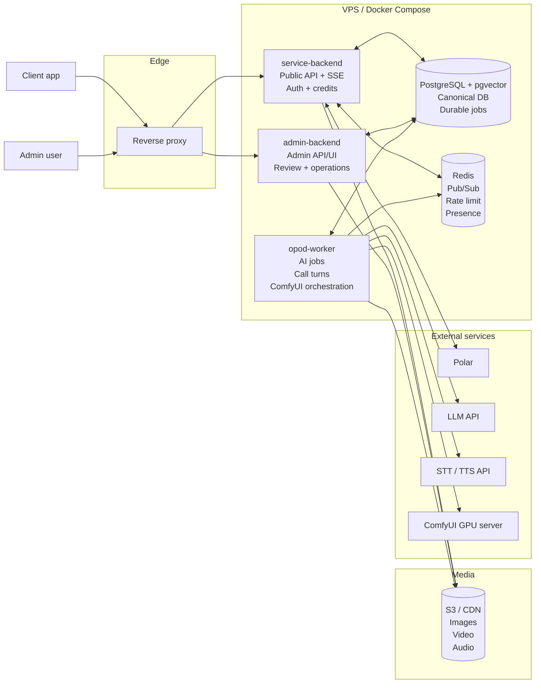
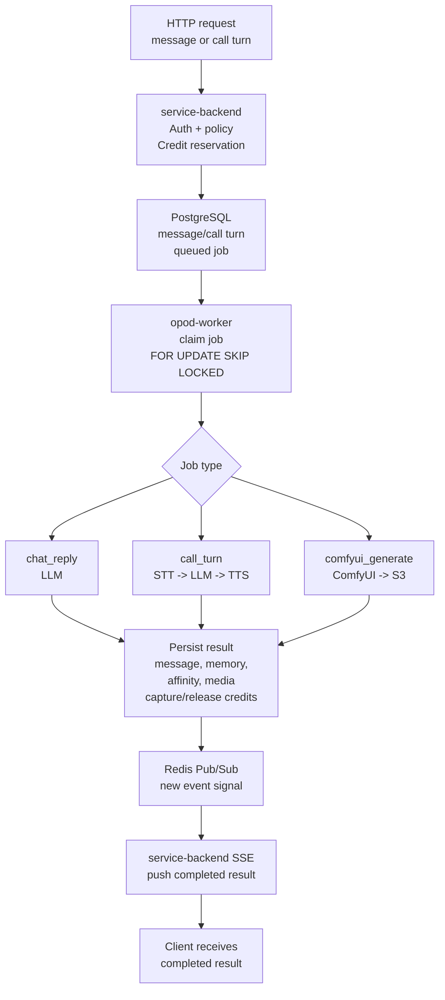

# OPOD Server Architecture

Date: 2026-07-06
Scope: server-side architecture only

## Decision

Use a modular Docker Compose deployment on one VPS.

Keep `opod-service-backend` as the public API and canonical database owner.
Keep `opod-admin` as a separate admin API/UI service. Add one `opod-worker`
runtime for async AI, media orchestration, and turn-based voice jobs. Use
PostgreSQL as the durable source of truth and Redis only for ephemeral realtime
fan-out and counters.

## Deployment Diagram



## Runtime Flow Diagram



## Components

### service-backend

Responsibilities:

- Public HTTP API entrypoint.
- User auth/authz.
- Credit policy, reservation, capture, release.
- Message write path.
- Turn-based phone session APIs.
- Feed, post, character, follow, report, notification, payment APIs.
- SSE connections for completed AI messages, call turns, and live commands.
- Polar checkout and webhook handling.

It does not call LLM, STT, TTS, or ComfyUI directly except for narrow health or
diagnostic checks. Heavy work goes through durable jobs.

### admin-backend

Responsibilities:

- Admin login, session, and roles: `owner`, `operator`, `reviewer`.
- Character, user, payment, credit, report, and media operations.
- AI-generated content review: approve, reject, regenerate, publish.
- Admin audit logs.

It reads and writes the shared OPOD database, but schema ownership stays in
`opod-service-backend`.

### opod-worker

One worker runtime handles multiple job types:

- `chat_reply`
- `memory_update`
- `affinity_update`
- `content_plan`
- `comfyui_generate`
- `call_turn`
- reservation expiry/release cleanup

Scale by running the same worker image with different queue filters:

```text
opod-worker --queues=agent
opod-worker --queues=comfyui
opod-worker --queues=call
```

This avoids a separate generation service while still allowing independent
scaling when image or voice jobs become heavy.

### PostgreSQL + pgvector

PostgreSQL is the durable source of truth:

- Users, characters, posts, media, messages, reports.
- Credit ledger, purchases, reservations.
- Durable job queue.
- Content plans and review state.
- Call sessions and call turns.
- Character memories, user-character memories, affinity.
- Embeddings for memory search through pgvector.

Worker locking should use PostgreSQL row locking, such as `FOR UPDATE SKIP
LOCKED`, so multiple worker processes can run safely.

### Redis

Redis is not the durable queue.

Use Redis only for:

- SSE fan-out Pub/Sub.
- Rate limit counters.
- Ephemeral presence and typing state.

If a Redis event is lost, clients recover by reading canonical state from
PostgreSQL through normal API calls.

### ComfyUI GPU server

ComfyUI runs on a separate GPU server. `opod-worker` calls it over HTTP, stores
results in S3/CDN, and updates media/content records.

### S3 / CDN

Stores generated and uploaded media:

- Feed images and reels.
- Story media.
- Call turn audio.
- Pre-rendered live clips after MVP.

## MVP Feature Handling

### Chat

User messages are HTTP writes. AI replies are generated asynchronously by
`opod-worker`. The client receives completed replies over SSE. No token
streaming for MVP.

### Memory And Affinity

Use both shared character memory and per-user character memory:

- `character_memories`: character-wide facts, setting, style.
- `user_character_memories`: facts from a specific user relationship.
- `user_character_affinity`: score, level, unlocked features.
- pgvector embeddings for long-term memory retrieval.

Affinity affects reply tone and feature unlocks.

### Credits

Use action-based pricing:

- `chat_reply`
- `image_generate`
- `story_generate`
- `call_turn`
- future `call_minute`

Credit flow is `reserved -> captured` on success or `reserved -> released` on
failure/timeout. The ledger records final grants and debits.

### Content Generation

AI content is generated automatically but published only after admin review in
MVP.

```text
planned -> generating -> review -> approved -> published
                                  -> rejected
                                  -> regenerating
```

### Phone

MVP phone is turn-based voice, not realtime WebRTC.

Flow:

```text
POST /calls
POST /calls/:id/turns
  -> user audio upload
  -> call_turn job
  -> STT
  -> LLM
  -> TTS
  -> AI audio stored in S3
  -> SSE call.turn.completed
```

This gives a phone-like product without TURN/STUN, WebRTC, or streaming
STT/TTS in the first server architecture.

## Post-MVP Extensions

### Reels And Stories

Reels and stories use the same media/content plan axis, but require media
processing when video becomes important:

- Transcode.
- Thumbnail.
- Duration and size validation.
- Optional HLS packaging.

Add a media-processing worker only when uploaded/generated video volume makes it
necessary.

### Live

Live is after MVP.

Start with pre-rendered clip orchestration:

- Store clips in S3/CDN.
- Map touch/chat/mood triggers to clip commands.
- Push `play_clip` commands over SSE.
- Let the client play media from CDN.

Do not add realtime video generation to MVP. If live later needs realtime
two-way audio/video, add a separate realtime-media service with WebRTC,
TURN/STUN, streaming STT/TTS, and avatar/live session state.

## Out Of Scope For MVP

- Separate chat service.
- Kubernetes.
- Redis as durable job queue.
- Realtime WebRTC phone.
- Realtime generated live video.
- Separate generation-worker service.
- External vector database.
